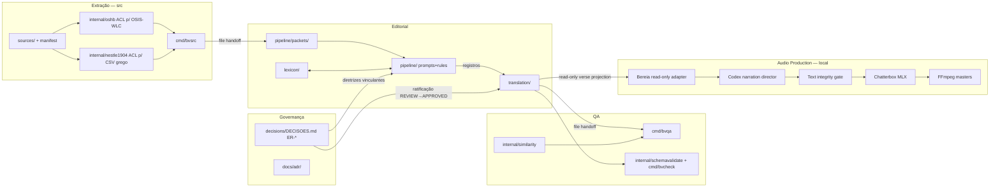

# Mapa de contextos — bereia-bible

Data: 2026-08-11 · Fonte: ADR-0001 · Escopo: repositório completo (Go + conteúdo)

## Contextos e integração

| Contexto | Conteúdo | Vocabulário próprio | Integração |
|---|---|---|---|
| **Extração** (`src`) | `sources/`, `internal/oshb`, `internal/nestle1904`, `cmd/bvsrc` | fonte, manifest, packet, palavra, lemma, morfologia | → Editorial via arquivo (packet JSON) |
| **Editorial** | `pipeline/`, `lexicon/`, `translation/` | perícope (agregado), versículo (entidade), proposta, consolidação, refutação, adjudicação, LexiconEntry | ← packets; → registros; lê diretrizes ER |
| **Governança** | `decisions/`, `docs/adr/` | Diretriz Editorial (ER-*), ADR, ratificação | vincula Editorial; registra ratificações |
| **QA** | `internal/similarity`, `internal/schemavalidate`, `cmd/bvqa`, `cmd/bvcheck` | similaridade, n-gram, LCS, contaminação, conformidade de schema | ← registros/controles via arquivo |
| **Audio Production** | `src/bereia_audio`, `character_registry.json`, `voices/`, `output/` | source unit, narration plan, character, voice profile, generation fingerprint, chapter master | ← Editorial by read-only file projection; → Codex, pinned Hugging Face snapshots, and FFmpeg through adapters |

Todas as integrações são **file handoff** (sem rede, sem RPC). Owner de todos os
contextos: Osvaldo Andrade (mantenedor). Glossários: `docs/domain/<contexto>/glossary.md`.

Audio Production is the sole exception to the original no-network statement:
its local adapters invoke the authenticated Codex CLI and download two pinned
model snapshots. It never exposes a server or writes back to Editorial. The
network-boundary decision and rollback live in ADR-0006.

## Decisões estruturais (registradas em ADR-0001)

- Hexagonal porta/adaptador **não aplicado**: não há serviço em runtime; `cmd/` é a
  porta de condução; arquivos são o lado conduzido. `internal/` plano.
- `internal/oshb` e `internal/nestle1904` são ACLs distintas: OSIS-WLC para o AT,
  CSV grego para o NT. Nenhum parser genérico mistura as duas morfologias.
- Perícope = agregado (fronteira transacional editorial); versículo = entidade
  (ID OSIS); ID do agregado = faixa OSIS (`Gen.1.1-5`). Consistência entre
  perícopes é **eventual**, propagada exclusivamente via `lexicon/` e `decisions/`.
- `internal/oshb` e `internal/similarity` não se importam mutuamente (depguard).
