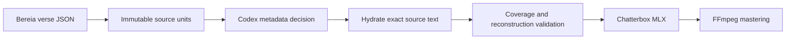

# Bereia Audio Production

Bereia Audio Production is a local, restartable CLI for the repository
maintainer's Apple M4 Max MacBook Pro. It reads only Bereia Version verse
records, asks Codex for narration metadata, proves textual reconstruction, runs
Chatterbox Multilingual on MLX/Metal, and masters chapter WAV and M4A files with
FFmpeg. It does not support CPU inference, CUDA, Docker, remote TTS, or another
Bible text source.

## Install

The setup requires macOS arm64, an Apple M4 Max, 128 GB of unified memory,
Homebrew Python 3.12, the authenticated `codex` CLI, FFmpeg, and network access
for the pinned model snapshots.

```bash
./scripts/setup.sh
```

The script creates `.venv`, installs the locked runtime, validates MLX/Metal,
downloads and loads the pinned Chatterbox model, and runs the Genesis smoke
test. It exits instead of switching to CPU when any hardware or Metal check
fails.

## Usage

```bash
.venv/bin/bereia-audio inspect
.venv/bin/bereia-audio analyze --book GEN --chapter 1
.venv/bin/bereia-audio generate --book GEN --chapter 1
.venv/bin/bereia-audio generate --book GEN --chapter 1 --voice voices/narrator.wav
.venv/bin/bereia-audio generate-book --book GEN
```

Python callers can use the source adapter directly:

```python
from bereia_audio import bible

chapter = bible.get_chapter("GEN", 1)
```

`analyze` replaces `narration.json` atomically after validation. `generate`
reuses an existing valid narration artifact. When an existing artifact fails
schema, source-hash, registry, unit-coverage, or reconstruction validation,
`generate` exits and preserves it for review; run `analyze` explicitly to
replace it.

## Text-integrity boundary



The director receives the complete chapter, the immutable source units, and the
current character registry. It returns unit identifiers and narration controls;
it does not supply authoritative text. The hydrator copies text from those
units into `narration.json`. The validator concatenates the segments and checks
`normalize(source_text) == normalize(reconstructed_segments)` before the model
loads.

## Voices and character continuity

`character_registry.json` owns the stable mapping from a canonical character
identifier to a `voice_id`. A matching `voices/<voice_id>.wav` takes precedence.
Generation requires an approved native Brazilian Portuguese
`voices/narrator.wav` (or `--voice` override) and fails closed when it is absent;
the model's built-in voice is forbidden. Missing character-specific references
use the approved narrator reference and appear as fallbacks in `metadata.json`.
The narrator reference participates in the cache fingerprint.

Reference audio must be a decodable WAV between 1 and 30 seconds. The resolver
hashes its bytes before generation and never constructs a shell command from
its path.

## Cache and restart behavior

The chapter fingerprint covers source text, canonical narration JSON, character
registry, resolved voice hashes, TTS package/model/tokenizer revisions, seed,
and generation/mastering parameters. The segment fingerprint covers the same
inputs narrowed to one segment. A matching chapter fingerprint skips all work;
a partial prior run reuses matching segment WAVs and resumes at the first
missing or stale segment.

## Outputs and diagnostics

The CLI writes `output/<BOOK>/<CHAPTER>/narration.json`, `metadata.json`,
`chapter.wav`, `chapter.m4a`, and the segment cache. Stable JSON events on
standard error carry a `run_id`, stage, coordinate, duration, and cache result.
`metadata.json` records aggregate timings, generated/reused segment counts,
audio duration, real-time factor, resolved voices, and all provenance fields.
Neither channel logs Bible text or credentials.

Exit codes are 2 for command usage, 3 for runtime incompatibility, 4 for source
failure, 5 for narration or integrity failure, 6 for TTS failure, and 7 for
mastering failure.

## Verification

```bash
python3.12 -m unittest discover -s tests -v
python3.12 -m compileall -q src tests
./scripts/test-genesis.sh
ffprobe -v error -show_entries format=duration:stream=codec_name,sample_rate,channels \
  -of json output/GEN/001/chapter.wav output/GEN/001/chapter.m4a
git diff --check
```

## Operations

Use `docs/runbooks/bereia-audio/generation.md` when analysis, model loading,
generation, or mastering stops. The CLI makes no production change, starts no
server, and needs no dashboard, alert route, rollout flag, or on-call rotation.
