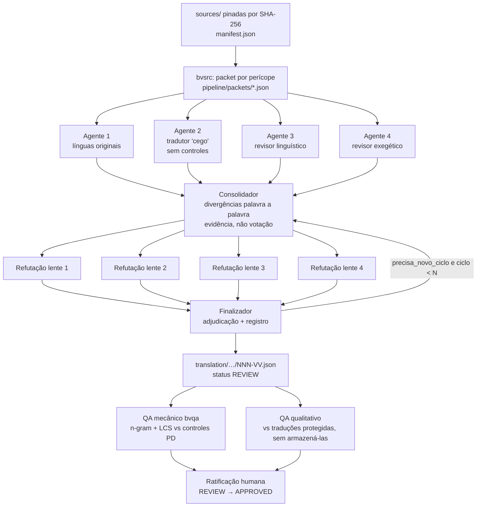

# PIPELINE — Bereia Version

Versão do processo: **1.2.0** · Mudanças exigem bump SemVer + entrada em `decisions/DECISOES.md`.
(1.2.0: revisão editorial do tier DRAFT sobre hot-spots estáticos — ER-0019.
1.1.0: autoridade NT Nestle 1904, packets gregos e driver fonte-neutro — ADR-0003/ER-0018.)

## Visão



## Unidade de tradução (modelo de domínio)

- **Perícope = agregado**: fronteira transacional da consistência editorial.
  ID do agregado: faixa OSIS (`Gen.1.1-5`). Nenhum registro é emitido antes de o
  ciclo da perícope inteira fechar.
- **Versículo = entidade** dentro do agregado, ID OSIS (`Gen.1.2`); materializa-se
  como Registro (`api/verse-record.schema.json`).
- **Consistência entre perícopes é eventual**, propagada exclusivamente por
  `lexicon/lexicon.json` (LexiconEntry) e `decisions/DECISOES.md` (Diretriz ER).
- Piloto: Gn 1:1–5 (dia um).

## Vocabulário de comandos e eventos (curator)

| Comando (imperativo) | Evento (particípio) |
|---|---|
| ProporTraducao | TraducaoProposta |
| ConsolidarPropostas | PropostasConsolidadas |
| RefutarConsolidacao | ConsolidacaoRefutada |
| AdjudicarDivergencia | DivergenciaAdjudicada |
| SubmeterParaRevisao | SubmetidoParaRevisao |
| RatificarRegistro | RegistroRatificado |
| SupersederLexiconEntry | LexiconEntrySuperseded |

## Independência dos agentes

- Os quatro agentes rodam em paralelo, sem ver as saídas uns dos outros.
- O Agente 2 (tradutor) recebe packet **sem** os controles (WEB/KJV/Livre) — só
  original + morfologia + léxico + regras. Agentes 1, 3 e 4 recebem controles
  exclusivamente para detecção de divergência.
- Prompts em `pipeline/prompts/` são versionados; o registro do versículo grava a versão usada.

## Consenso (N ≤ 3 ciclos)

1. Quatro propostas independentes.
2. Consolidador compara palavra a palavra com OSHB/Nestle 1904; lista divergências;
   exige justificativa lexical/gramatical; produz proposta consolidada.
3. Quatro refutações adversariais (uma por lente).
4. Finalizador adjudica por evidência (votação é proibida), corrige, e:
   - sem mudança material → registro final;
   - com mudança material e ciclo < N → novo ciclo a partir da consolidação;
   - objeção inconclusiva → texto não muda, objeção fica em
     `objecoes_nao_resolvidas` (bloqueia APPROVED).

## FSM de status (steward)

| De | Para | Gatilho | Efeito |
|---|---|---|---|
| — | DRAFT | packet processado, registro emitido sem ciclo completo | registro gravado |
| DRAFT | REVIEW | ciclo de consenso completo + QA de contaminação executado | registro atualizado |
| REVIEW | APPROVED | ratificação humana registrada em `decisions/DECISOES.md` | texto publicável |
| APPROVED | REVIEW | **somente** diff + justificativa + novo ciclo multiagente completo | reabre auditoria |
| qualquer | qualquer outra | — | **transição ilegal; rejeitar** |

Estados terminais não existem: APPROVED é estável, não imutável — mas só reabre
pela transição auditada acima. Registros nunca são apagados, apenas versionados via git.

## Determinismo (política honesta)

O que é determinístico por construção: fontes (SHA-256), prompts, regras, léxico,
schema, decisões persistidas — todos versionados no git. O que não é: amostragem
do modelo (a infraestrutura de sessão não expõe temperatura). Mitigação: a camada
determinística é o **artefato persistido** — uma vez gravada a decisão no léxico
ou no registro, regenerações não podem contrariá-la sem diff + novo ciclo + nova
revisão. O campo `fontes` de cada registro grava modelo e versões usadas.

## QA de contaminação (copyright)

1. **Mecânico** (`cmd/bvqa`): n-grams de palavras (3–5) e maior subsequência comum
   entre o texto BV e os controles **armazenados** (todos PD/CC-BY: Bíblia Livre;
   WEB/KJV são inglês, servem de controle semântico, não lexical).
2. **Qualitativo**: agente compara a redação BV com ARA/NVI/NAA/NTLH (conhecimento
   de modelo; nada dessas versões é armazenado). Coincidência extensa não exigida
   pelo original → reavaliar a partir das fontes. Proibido: reescrever
   artificialmente só para reduzir similaridade. Coincidência inevitável
   (tradução natural do original) é mantida e anotada.

## Ciclos de reparo e re-pinagem de fontes (ER-0010)

Todo ciclo de reparo/consistência re-pina **todos** os campos de `fontes` do
registro para as versões efetivamente lidas naquele ciclo (léxico, regras,
prompts, modelo) — nunca preserva pins do ciclo anterior. Pin desatualizado em
registro é defeito de dados.

## Revisão editorial do tier DRAFT (ER-0019)

Etapa posterior à cobertura DRAFT (ER-0016/0017), aplicada somente a hot-spots:

1. **Triagem estática** (`scripts/qa_linguistico.py`): marcadores mecânicos sobre
   `texto_bv` de registros DRAFT — arcaísmos (§1.2), sentenças > 40 palavras (§1.3),
   calques paratáticos, redundância interna, excesso de pronomes/passivas,
   divergência de extensão vs `traducao_literal`. Saída: `qa/reports/hotspots.json`
   + `hotspots.md` + digest por capítulo hot (`qa/reports/review-input/`).
   O detector apenas flagra; a adjudicação (corrigir vs manter fórmula intencional)
   é do agente revisor.
2. **Revisão por capítulo** (`pipeline/orchestration/review-chapter-driver.workflow.js`,
   prompt canônico `pipeline/prompts/revisor-editorial-draft.md`): 1 agente por
   capítulo hot, até 16 em paralelo. Mudança somente de FORMA, nunca de sentido.
3. **Persistência** (`scripts/persist_review.py`): exige cobertura OSIS exata;
   aplica `texto_bv` revisado e registra cada mudança em `decisoes`
   (`diretriz_ref: ER-0019`); objeção MATERIAL não altera o texto e entra em
   `objecoes_nao_resolvidas` (bloqueia APPROVED); re-pina `fontes` (ER-0010).
   O status **permanece DRAFT** — promoção a REVIEW continua exigindo o ciclo de
   consenso pleno + QA de contaminação.

Reprodução:

```
python3 scripts/qa_linguistico.py            # triagem; limiar -threshold (padrão 8)
# Workflow review-chapter-driver com args.chapters = capítulos hot
python3 scripts/persist_review.py qa/reports/review-out/01-gn-024.json -modelo <modelo-do-ciclo>
./bin/bvcheck -records translation/01-gn/024 -lexicon lexicon/lexicon.json
git commit por capítulo
```

## Reprodução

```
make packets         # packet completo (com controles WEB/KJV/Livre)
make packets-blind   # packet cego do Agente 2 (sem controles)
# orquestração multiagente conforme este documento (prompts versionados em
# pipeline/prompts/; scripts executados arquivados em pipeline/orchestration/)
make verify          # gofmt+vet+build+test+zero-dep+bvcheck(registros+léxico)+checksums
./bin/bvqa -records translation/01-gn/001 -livre sources/pt-pd/livre.getbible.json \
  -booknr 1 -chapter 1 -out qa/reports/gen-001-001-005.similarity.json
```
